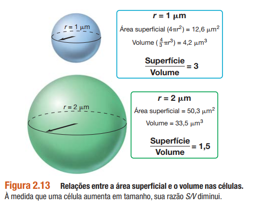
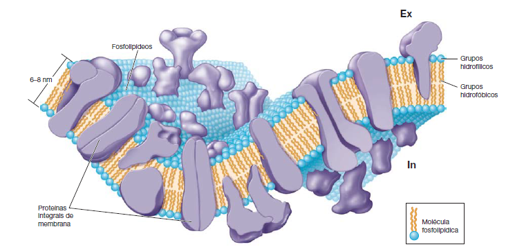
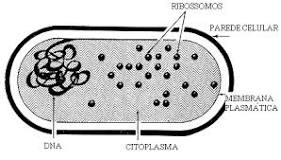
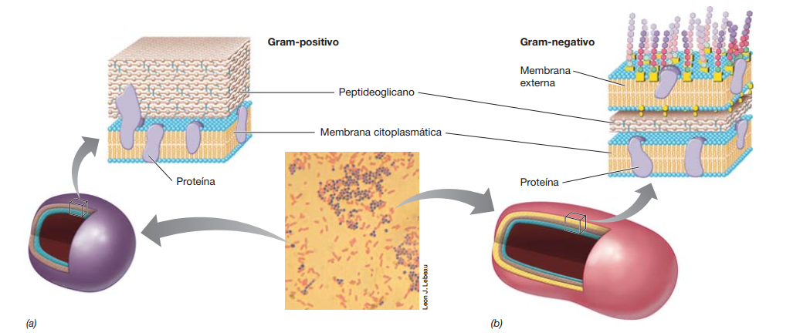
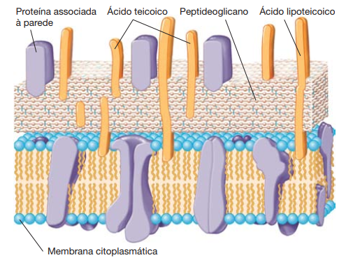
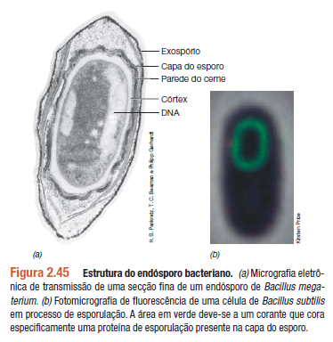
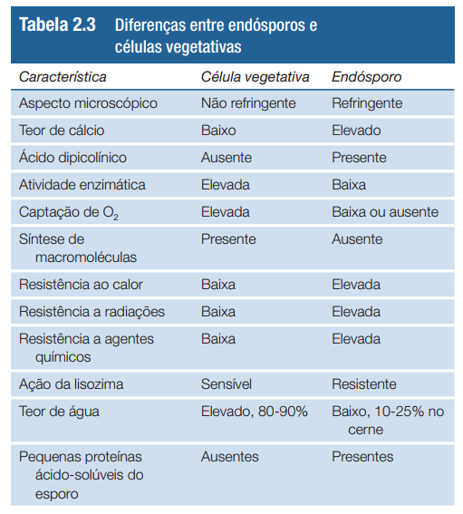

# **MICROBIOLOGIA DE BROCK**

## CAPÍTULO 2 - ESTRUTURAS CELULARES MICROBIANAS E SUAS FUNÇÕES

MOTILIDADE

- E. Coli
  - flagelo
  - rotação
  - flagelina
  - rápida
- Halobaterium - arqueia
  - flagelo rotacional mais fino
  - lenta
- Methanocaldococcus
  - flagelo em tufos
  - org mais rapido da Terra - 500 comp. celulares por segundo

### MICROSCOPIA

Pode ser óptico (ampliação baixa, máx 2 micrometros 2.10^-6) ou eletrônico (ampliação alta).
Fator importante é a resolução - baseada nas propriedades da luz.

#### MICROSCOPIO OTICO

Usa a luz visível. vário vitpos:

- **de campo claro**
  - discretas diferenças de contraste existentes entre eles e o meio circundante
  - duas lentes: objetiva (10 a 100x) e ocular (10 A 20x)
    - lentes de óleo de imersão (objetiva) - aumenta a capacidade de concentração de luz na lamina
  - condensador - que foca a luz
  - aumento máx de 2000x
  - abertura numérica
    - uma medida da capacidade de captação de luz
    - lentes de maior aumento normalmente apresentam aberturas numéricas maiores
    - O diâmetro do menor objeto que pode ser distinguido por qualquer lente é igual a 0,5y/abertura numérica, em que y(lambda) é o comprimento de onda da luz utilizada.
    - luz azul tem comprimento de onda menor
- **de contraste de fase**
  - para observação de preparações vivas (coloração mata as células e pode alterar composição)
  - > as células diferem de seu meio circundante quanto ao
    > índice de refração (um fator pelo qual a luz sofre um retardo ao
    > atravessar um material).
  - anel de fase: fica na lente objetiva, aparece escuro em fundo claro
- **de contraste de interferência diferencial - CDI**
  - tem um polarizador no condensador
  - dois feixes de luz atravessam o especime e forma variações que o colocam em perspectiva 3D
- **de campo escuro**
  - luz atinge apenas lateralmente
  - aparece claro em fundo escuro
  - normalmente tem melhor resolução
  - bom para ver motilidade
- **de fluorescência**
  - emitem luz de uma cor após receber luz de outra cor
  - fluorescência natural - ex: clorofila
  - DAPI - (49,6-diamidino-2-fenilindol) é um corante fluorescente
    - em azul brilhante
    - comum na microbiologia diagnóstica
- aumento do contraste por coloração

  - compostos orgânicos - cada classe de corantes apresenta afinidade específica por determinados compostos celulares
  - corantes básicos = carregados positivamente
    - azul de metileno, o cristal violeta e a safranina
    - se ligam a ácidos nucleicos e superfície celular
    - > PASSO A PASSO DE COLORAÇÃO BÁSICA
      >
      > 1. esfregaço e espera secar ao ar
      > 2. fixação pelo calor (sob uma chama?)
      > 3. cobre com corante, lava e seca
  - corantes diferenciais = conferem diferentes cores a diferentes celulas
  - coloração de gram
    - corante diferencial
    - bact divididas em positivas e negativas
    - POSITIVAS: roxo-violeta
    - NEGATIVAS: rosa
    - > PASSO A PASSO DA COLORAÇÃO DE GRAM
      >
      > 1. coloração básica com cristal violeta
      > 2. etanol - descolore as gram negativas
      > 3. coloração com safranina ou outro para distinção em microscópio

- **Microscopia de laser de varredura confocal (MLVC)**
  - computadorizado
  - fonte de raio laser acoplada
  - a luz foca em apenas um plano e o laser interfere nos outros
  - imagens de várias camadas - biofilmes ou tapetes microbianos
  - > As preparações celulares para MLVC podem ser tratadas com corantes fluorescentes, tornando-as mais facilmente distinguíveis

#### MICROSCOPIA ELETRÔNICA

Usam elétrons ao invés de luz visível; eletroimãs como lente. Obtém fotos.
Normalmente são em preto e branco, e a cor é adicionada digitalmente.

- **de transmissão - MET**
  - aumento e resolução muito elevados - 0,2 nanomêtros
  - estruturas celulares, inclusive em nível molecular
    - > para a visualização de estruturas internas de uma célula, cortes finos dessa célula são necessários, e esses cortes precisam estar estabilizados e corados com vários químicos para torná-los visíveis.
    - corantes: ácido ósmico, ou sais de permanganato, urânio, lantânio ou chumbo
    - coloração negativa: celulas intactas e alguns componentes, sem corte??
- **de varredura - MEV**
  - recoberto com uma fina camada de metal pesado
    - os eletrons se dispersam pelo metal e são coletados, formando a "imagem"
  - boa profundidade de campo
  - observa apenas a superfície

## CÉLULAS DE BACTÉRIAS E ARQUEIAS

Procariotas.

### MORFOLOGIAS

São apenas descritivas e representativas, podendo aparecer muitas variações. Algumas são mais comuns (**bacilos**) e outras mais incomuns.

Não á um bom indicador das outras características/propriedades daquela célula. A morfologia pode explicar: captação de nutrientes, mobilidade (natatória ou deslizamento), adequação ao habitat.
As principais morfologias:

- coco / cocos
  - esférica ou ovalada
  - streptococos - filas
  - stafilococos - cacho de uvas
  - sarcina - cubos 3D
- bastonete / bacilos
  - cilíndrica
- espirilos
  - bastonetes retorcidos, espirais

### TAMANHO

Podem ter de 0,2 micrometros a 600 micrômetros de diâmetro. Se tiverem menos de 1,5 micrometros elas não conseguem guardar tudo que precisam nelas, e asism não se desenvolvem.

Taxa metabolica é inversamente proporcional ao quadrado de seu tamanho. células muito grandes tem metabolismo mais limitado.

#### SUPERFÍCIE x VOLUME --> TAXA DE CRESCIMENTO E EVOLUÇÃO

Células pequenas: Área superfíce (_S_) > volume celular (_V_) = maior razão _S/V_

<fig> Razão _S/V_ </fig>

A razão _S/V_ afeta:

- evolução celular - afeta a troca de nutrientes, quanto maior, mais lenta a troca.
- nutrientes disponíveis alimentam uma população maior de celulas pequenas
- mutações - quanto mais rápido se reproduz, mais mutações e melhor a evolução - se adaptam melhor ao ambiente

> várias bactérias
> patogênicas também são muito pequenas. Quando o genoma
> desses patógenos é estudado, verifica-se que eles são altamente
> simplificados, e contam com a ausência de muitos genes cujas
> funções são fornecidas a eles pelos seus hospedeiros.

### MEMBRANA CITOPLASMÁTICA

#### DE BACTÉRIAS

- É estruturalmente fraca, e se for rompida gera morte celular.
- 8 a 10 nanometros de espessura - vista no MET
- Função principal: permeabilidade seletiva.
- bicamada fosfolipidica
  - acidos graxos - hidrofobicos - para o interior
    - os mais comuns tem 14 a 20 carbonos
  - glicerol fosfato - hidrofílico - para o exterior

<fig> Membrana Citoplasmática </fig>

  - não é rigida, parece um óleo pouco viscoso
- rodeada por proteínas
  - hopanoides - parecem esterois que ficam na membrana de bacterias, reforçando-as
  - ligação éster entre Acidos Graxos e glicerol
- proteínas
  - **integrais** (de membrana): encontram-se firmemente embebidas na membrana
  - **periféricas** (de membrana): firmemente associadas à membrana, mas não embebidas - muitas são lipoproteínas - interagem com as integrais
  - **outras**: uma porção ancorada na membrana, e regiões extramembranosas voltadas para o interior ou exterior da célula

#### DE ARQUEIAS

- Ligações éter entre Acidos graxos e cadeias hidrofóbicas - não possuem acidos graxos
- A membrana citoplasmática de arqueias é formada ou de glicerol diéter, que apresenta cadeias laterais de 20 carbonos ou de diglicerol tetraéter, que apresenta cadeias laterais de 40 carbonos
- Membrana em monocamada
  - Muito resistente ao calor
  - pode ter uma combinação de mono e bicamada
- Muitos dos lipídeos de arqueias contêm anéis no interior das cadeias laterais de hidrocarbonetos
  - 5 carbonos - ciclopentil
  - 6 carbonos - ciclohexil
  - afetam as propriedades quimicas e funções da membrana

#### FUNÇÕES

- Barreira de permeabilidade
  - impede a passagem passiva de substancias
  - moléculas polares e carregadas não são capazes de se difundir e necessitam ser transportadas (mesmo um átomo +)
  - a água consegue atravessar - por difusão ("automaticamente")
- sítio de ancoragem pra proteínas
  - conservam energia
  - **transporte de substâncias**
    - importar nutrientes, exportar resíduos
    - _efeito de saturação_ - velocidade de captação máxima
    - passa do mais concentrado para o menos
    - _alta especificidade_ - somente um ou alguns tipos de moléculas
    - _síntese altamente regulada_ - na membrana tem carreadores/proteinas que são necessárias de acordo com as substancias ali naquele meio
    - **mecanismos (em procariontes)**:
      - _transporte simples_ - uma proteína
      - _translocação de grupo_ - uma série de proteínas
        - a substância transportada é quimicamente modificada durante o processo de transporte
        - um composto orgânico rico em energia em vez da força próton-motiva conduz o evento de transporte
      - _transporte ABC_ - ATO-binding-cassete
        - 3 componentes = 1 prot de ligação, 1 transportador integrado à membrana e 1 proteína que hidrolisa o ATP
        - proteínas periplasmática - típicas em gram-negativas
          - o periplasma é uma camada membranosa na parte externa das gram-negativas
          - normalmente em transporte ABC
          - possuem muita afinidade com substrato
          - nas gram-positivas ficam aderidas direto na membrana
      - proteínas atravessam a membrana e formam um canal no meio
    - **eventos reais de transporte**
      - _uniporte_ - proteínas transp. que levam apenas em uma direção (dentro ou fora da celula)
      - _simporte_ - transportam uma molécula com outra substância - por ex um próton
      - _antiporte_ - transporta uma pra dentro da célula e junto uma pra fora da célula
  - armazenam substâncias
- força proton-motiva - estado carregado + da membrana
  - transporte, natação, motilidade, biossíntese de ATP

### PAREDE CELULAR

<fig> Partes das Bactérias </fig>

Protege contra a lise celular e mantém a forma e rigidez.

> (...) muitos antibióticos têm como alvo a síntese da
> parede celular, deixando a célula suscetível à lise.

- formada por polissacarídeos tanto em gram positivas quanto em gram negativas
- Peptídeoglicano
  - Só existe em bactérias, não em arqueias ou eucariotos
  - dois derivados de açucares e aminoácidos
  - ligações cruzadas em X e Y criam rigidez
  - pode ser destruído pela lisozima (proteína em lágrima, saliva e fluidos corporais), possibilitando entrada de água e lise celular
  - a penicilina enfraquece a síntese da parede celular e gera uma lise osmótica (pela pressão interna)
  - envelope celular - gram negativas
    - duas camadas
  - gram positivas - apenas uma camada muito mais espessa
    _90% é peptideoglicano
    _ varias camadas sobrepostas
    _acidos teicoicos - moléculas ácidas embebidas na parede celular
    _ responsáveis parcialmente pela carga negativa da superficie celular
    _pegam Mg2+ e Ca2+ para transportar pro interior da célula
    _ micoplasmas - bactérias patogênicas que conseguem sobreviver sem parede celular
  

<fig> Parede celular de grams positivas e negativas, respectivamente</fig>

<fig> Parede celular de gram-positivas em detalhe </fig>

#### LPS - MEMBRANA EXTERNA

- Substitui o peptideoglicano em gram-negativas.
- é uma bicamada lipídica
- contem fosfolipídeos, proteínas, e polissacarídeos
- LPS = lipopolissacarídica
- polissacarídeo cerne
- polissacarídeo O-específico - geralmente contém hexoses
- composição química diferente da membrana citoplasmática
- gera toxicidade aos animais - principalmente relacionado ao lipídeo-A

#### PERIPLASMA

- região entre a superfície externa da membrana citoplasmática e a superfície interna da membrana externa
- parece um gel, pois tem muitas proteínas - moléculas grandes que não atravessam a membrana citoplasmatica
- > incluem enzimas hidrolíticas, que promovem a degradação inicial das moléculas de alimento; proteínas de ligação, que iniciam o processo de transporte de substratos; e quimiorreceptores, que são proteínas envolvidas na resposta quimiotática.
- porinas - são proteínas que atuam como canais que permitem entrada e saída de solutos
  - existem as específicas e inespecíficas
  - > As porinas inespecíficas formam canais preenchidos por água, pelos quais qualquer substância pequena consegue passar. Em contrapartida, as porinas específicas possuem um sítio de ligação para somente uma ou um pequeno grupo de substâncias estruturalmente relacionadas.

#### PAREDE CELULAR E COLORAÇÃO DE GRAM

Na **gram-positiva** a parede celular é desidratada pelo álcool que fecha os poros. Na **gram-negativa** o alcool penetra a parede rapidamente e consegue extrair o cristal violeta.

#### PAREDE DE ARQUEIAS

- não tem peptideoglicano e normalmente não tem membrana externa
- possuem vários tipos de paredes celulares
  - pseudomureína - parece muito o peptideoglicano
  - outros polissacarídeos
  - camada S
    - uma camada superficial cristalina
    - moléculas de proteínas ou glicoproteinas entrelaçadas
    - existe em diversas espécies de bactérias
    - as camadas S são suficientemente resistentes para suportar pressões osmóticas sem qualquer outro tipo de componente de parede.
    - é sempre mais externa, em contato com o ambiente, quando existe alguma outra estrutura
    - funções
      - barreira seletiva
      - proteção
      - retenção de proteínas
      - estabelece a forma

### OUTRAS ESTRUTURAS DE SUPERFÍCIE CELULAR
>
> Vários procariotos secretam substâncias limosas ou viscosas
em sua superfície celular, que consistem em polissacarídeos
ou proteínas.

- Não são parede pois não geram resistência
- **Cápsula**:
  - matriz compacta
  - visível em microscopia optica
  - aderidas firmemente à parede celular
- **Camada Limosa**:
  - mais deformável
  - não exclui partículas pequenas
  - mais difícil de ver
  - ligação frouxa com a parede celular
- funções:
  - se ligar a superfícies sólidas
  - desenvolvimento e manutenção de biofilme: espessa camada de células bacterianas em superfície sólida
  - fatores de virulência
  - prevenção a desidratação da célula
  - ajuda a evitar o reconhecimento pelas células de defesa da vítima
- **Fímbrias**:
  - proteína filamentosa
  - adesão a superfícies, incluindo tecidos animais ou formação de películas em superfícies solidas
- **Pili**
  - mais longas que as fímbrias
  - receptores de determinados vírus
    - bem visualizadas em mic eletrônico quando estão nessa condição
  - 2 classes de pili:
    - pili tipo IV - adesão celular, motilidade pulsante (forma de motilidade incomum), presente apenas nos polos de algumas células
  - funções:
    - conjugação - processo de troca genética entre as células
    - impedir adesão de patógenos
- **Inclusões**
  - reserva de energia
  - reservatório de carbono
    - reduz o estresse osmótico
    - PHB - ácido poli-b-hidroxibutírico **OU** PHA - poli-b-hidroxialcanoato (mais genérico) **OU** glicogênio
    - se agrega em grânulos
  - polifosfato - fontes de fosfato na biossíntese de ácidos nucleicos e fosfolipídeos
  - visualizadas no micro optico
  - possuem membranas de camada única que as isolam dentro da célula
  - bacterias sulfurosas - acúmulo de enxofre em grânulos no citoplasma
  - biomineralização - processo de formação de granulos de minerais
  - magnetossomos - estruturas que permitem que algumas bactérias se orientem em campos magnéticos (magnetotaxia)
    - formado por Fe3O4 ferro magnetita ou enxofre greigite Fe3S4
    - geram dipolo magnético na célula
- **vesículas de gás** - em planctônicos, que vivem flutuando em águas (bactérias e arqueias)
  - podem ser vistas em microssopio oticos
  - de uma a centenas por celula
  - tamanho muito variável
  - feitas por 2 proteínas, GvpC e GvpA
- **endósporos**
  - criada pelo fenomeno esporulação
    - processo de diferenciação celular
    - possui várias fases
  - é uma etapa da ("vida" da) célula
  - só encontrada em uma sublinhagem de gram-positivas, não aparecem em arqueias
  - extrema resistência ao calor, produtos químicos fortes e radiação
  - sobrevivência e resistência
  - facilmente levados pelo vento
  - normalmente no solo
  - só aparecem na fase que a célula não está mais crescendo
  - 3 fases:
    - ativação - no calor alto subletal
    - germinação - recebem nutrientes específicos
    - extrusão

<fig>Estrutura do endósporo</fig>
  - exospório - camada proteica delgada
  - capa do esporo - proteínas específicas do esporo
  - córtex - peptideoglicanos com ligações cruzadas frouxas
  - cerne - contém a parede do cerne, a membrana citoplasmática, o citoplasma, o nucleoide, os ribossomos e outros constituintes celulares essenciais
    - citoplasma é em gel
    - aumento da resistencia térmica e a toxinas, principalmente por causa da desidratação
    - PPASs - pequenas proteínas de ácido-solúveis
      - ligado ao DNA, deixa mais compacto e protege contra radiação e calor
      - fonte de carbono e energia na hora da extrusão de nova célula
  - ácido dipicolínico - substância específica de endósporos - reduz a disponibilidade de água

<tab>Diferença entre etapas da diferenciação celular de bactérias</tab>

## LOCOMOÇÃO MICROBIANA

- pode ser natatório ou deslizante
- taxias = capacidade de se afastar de certos estímulos

### FLAGELOS

- natatório
- mov rotatório
- > são apêndices longos e finos, apresentando uma extremidade livre e outra extremidade ligada à célula.
- precisa de coloração especial para ver em microscopio optico
- O tipo de flagelação é usado para classificar bactérias
  - **flagelação polar**
    - flagelos se ligam à celula em uma ou ambas as extremidades
    - lofotríquia: quando tem um tufo em uma das extremidades
    - anfitríquia: tem tufo nas duas extremidades
  - **flagelação peritríquia**
    - flagelos por toda a superfície
- são helicoidais, formados por várias cópias de flagelina (proteína)
- gancho: parte que conecta o flagelo na base motora
- base motora ou motor: um bastão central que passa por meio de uma série de anéis
  - em gram-negativas:
    - anel L externo na cama lipoproteica
    - anel P no peptideoglicano da parede celular
    - MS: dentro da membrana citoplasmática
    - aneis C: no citoplasma
  - em gram-positivas:
    - apenas MS e aneis C
  - rotor: bastão central e aos anéis L, P, C, e MS
    - formam o corpo basal
    - turbina de protons: confere o movimento rotativo por movimento de protons na membrana citoplasmática
  - estator: proteínas mot: geram torque
- proteinas MOT: por onde passam os protons para gerar movimento
- proteínas FLI: inverte o movimento do flagelo
- em arqueias:
  - mais delgados
  - várias flagelinas diferentes, nada a ver com as bacterianas
  - alimentados por ATP e não protons
- o filamento flgelar começa pela ponta, e não pela base
  - primeiro é o anel MS, inserido na membrana plasmatica
  - as proteínas passam pelo filamento e formam a ponta
    - as proteínas cap ajudam a flagelina a ir passando e formando a ponta e crescendo
    - ocorre de maneira contínua até o tamanho final
  - flagelos quebrados podem rotacionar e ser reconstruidos
- velocidade:
  - não é constante
  - > Organismos com flagelação peritríquia normalmente deslocam-se em linha reta, de forma lenta e intencional.
  - flagelação polar: rapido, girando ao redor de si mesmo
- corrida: se move pra frente suavemente
- oscilação: fica parada mas bamboleando
> Durante o movimento para frente em uma corrida, o
motor flagelar gira em sentido anti-horário. Quando os flagelos
giram em sentido horário, o feixe de flagelos é separado, a
movimentação para frente é interrompida, e a célula passa a
oscilar

### DESLIZAMENTO

- lento e suave
- ao longo do eixo da célula
- celulas filamentosas ou bacilares
- requer superfície sólida
- ao deslizar, afastam-se do centro da colônia
- apenas bactérias, principalmente cianobactérias, e nenhuma arqueia
- mecanismo:
  - secreção limosa
  - motilidade pulsante
    - pili IV
  - motilidade específica por proteínas que ficam na membrana citoplasmática e/ou na externa
- permite interação entre células, cooperação, 

### TAXIAS

#### QUIMIOTAXIA

- muito conhecida em bactérias natatorias
- ocorre em arqueias também, pelas mesmas proteínas
- uma célula encontra um gradiente de um composto em um ambiente e se aproxima ou se afasta dele de forma automática e não aleatória
- células peritríquias:
  - > enquanto se movimenta, a célula monitora seu ambiente, comparando seu estado químico àquele percebido poucos momentos antes
    - cascata de proteínas
    - proteínas quimioreceptores
- células polares:
  - a rotação flagelar é interrompida de tempo em tempo e quando volta a girar, segue em uma direção aleatória
  - > Por meio da reorientação aleatória,
a célula eventualmente encontra uma via de concentração
crescente do atrativo, mantendo uma corrida até que seus quimiorreceptores
encontrem-se saturados ou que perceba uma
diminuição na concentração do agente atrativo.
- Como medir a quimiotaxia?
  - método do capilar

#### FOTOTAXIA

- atração pela luz
  - depende do comprimento de onda
- realizar fotossíntese
- > as células se movem de um gradiente de luz de baixa intensidade para um de alta intensidade
- fotorreceptores análogos aos quimiorreceptores
- escotofobotaxia:
  - para fora do campo luminoso do microscópio
  - afeta negativamente a fotossíntese
  - afeta negativamente a energia da célula e faz ela mudar de sentido e voltar à luz
- Outras taxias:
  - aerotaxia: do oxigênio
  - osmotaxia: força iônica
  - hidrotaxia: água

### EUCARIOTOS MICROBIANOS

- Fungos, algas, protozoários
- variam nas organelas
  - (quase) universais:
    - mitocondrias
    - aparelho de golgi
    - lisossomos
    - ret endoplasmático
    - microtúbulos e microfilamentos
  - específicas:
    - cloroplastos
    - flagelos ou cílios
    - parede celular (algas e fungos)
- todas tem um núcleo por um par de membranas
  - contem os cromossomos
  - enrolados em histonas
  - membranas
    - separadas por um espaço
    - interna: um saco simples; interação com o nucleoplasma
    - externa: contínua ao ret end; interação com o citoplasma
  - transporte nuclear - passagem de substancias pelos poros
  - nucleolo - dentro do nucleo - síntese de RNA ribossomal (forma ribossomos)
- divisão celular
  - mitose e meiose
  - diploides ou haploides

#### MITOCÔNDRIAS

- respiração de celulas aeróbias
- dimensões bacterianas
- varia em numero
- duas membranas
  - a externa tem poros
  - a interna tem estrutura mais parecida com as de bacterias
  - cristas: membranas internas convolutas
    - invaginações da membrana interna
    - contem enzimas da respiração e da produção de ATP
  - matriz mitocondrial: dentro da mitocondria
    - > contém enzimas envolvidas na oxidação
de compostos orgânicos, em particular, as enzimas do
ciclo do ácido cítrico, a principal via para a combustão de compostos
orgânicos em CO2

#### HIDROGENOSSOMO

- anaeróbios, sem mitocondrias
- do tamanho de mitocondrias
- desprovido das enzimas do ciclo do ácido cítrico
- não apresenta cristas
- metabolismo estritamente fermentativo
- oxidação do composto piruvato a H2, CO2 e acetato

#### CLOROPLASTOS

- contem clorofila
- eucariotos fototróficos
- realizam fotossintese
- grandes, visiveis em micro optico
- numero varia
- membrana externa permeável
- membrana interna menos permeável
  - circunda o estroma ("matriz mitocondrial")
    - contém ribulose bifosfato carboxilase (RubisCO)
    - enzima do ciclo de Calvin
- tilacoides:
  - série de discos membranosos achatados
  - onde ocorrem as reações com a clorofila

#### ENDOSSIMBIOSE

- mitocôndrias e cloroplastos relacionados com bactérias através de relação de simbiose
- > Gradualmente, ao
longo do tempo, esses simbiontes originalmente de vida livre
tornaram-se parte íntima da célula eucariótica.
- Evidências:
  - possuem seus próprios genomas e ribossomos
  - genoma circular

#### RETÍCULO ENDOPLASMÁTICO

- rede de membranas
- dois tipos
  - rugoso - tem ribossomos; produtor de glicoproteínas,
  - liso - síntese de lipídeos e metabolismo de carboidratos

#### APARELHO DE GOLGI

- conjunto de membranas empilhadas
- atua com o Ret End, modificando seus produtos

#### LISOSSOMOS

- compartimentos envoltos por membrana
- contêm diversas enzimas digestivas
- hidrolisam proteínas, gorduras e polissacarídeos
- funde-se a vacúolos

### CITOESQUELETO

#### MICROTÚBULOS

- tubos com cerne oco
- compostos pelas proteínas a-tubulina e b-tubulina
- funções:
  - manutenção da forma celular
  - motilidade da célula realizada pelos cílios e flagelos
  - na movimentação dos cromossomos durante a mitose
  - na movimentação das organelas dentro da célula

#### MICROFILAMENTOS

- mais finos
- duas fitas entrelaçadas de actina
- funções:
  - manutenção e modificação da forma celular
  - motilidade celular por pseudópodes
  - divisão celular

#### FILAMENTOS INTERMEDIÁRIOS

- proteinas fibrosas espessas
- manutenção da forma celular
- posicionamento das organelas
