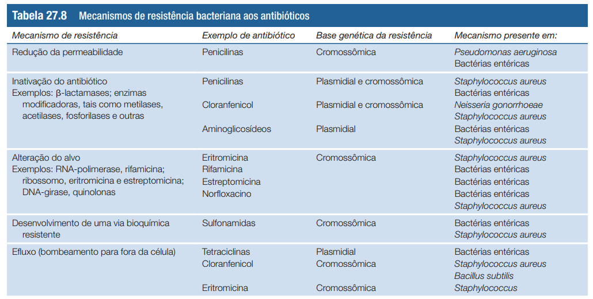
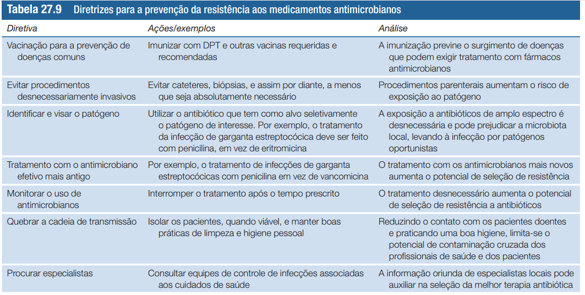

# **MICROBIOLOGIA DE BROCK** CAPÍTULO 27 (pt. V) - RESISTÊNCIA A FÁRMACOS ANTIMICROBIANOS (p. 819-824)

> A resistência disseminada aos fármacos antimicrobianos é rotineiramente transmitida por meio da transferência gênica horizontal e entre os microrganismos.

## MECANISMOS DE RESISTÊNCIA

- pode ser codificada geneticamente tanto por um cromossomo como por um plasmídeo (plasmídeo R)
    - mais comum nos plasmideos
        - transmitem de forma horizontal
    - codificam enzimas que inativam o fármaco, impedem sua captação ou expulsam pra fora da célula
    - podem ter vários genes que dão resistência a diferentes antibióticos
- os testes de sensibilidade devem ser feitos com frequência em espécimes clínicos
- Os plasmídeos R e os genes de resistência são anteriores à utilização generalizada dos antibióticos. O uso exagerado de antibioticos seleciona esses que já existiam e eles se tornam mais abundantes.

> Uma linhagem de Escherichia coli congelada e desidratada em 1946 continha um plasmídeo com genes conferindo resistência à tetraciclina e estreptomicina, embora nenhum desses antibióticos tenha sido utilizado clinicamente, a não ser vários anos mais tarde

<tab></tab>

### DISSEMINAÇÃO DE RESISTÊNCIA

- uso inadequado, indiscriminado
- uso excessivo
- desobediência do paciente
- uso na agricultura e pecuária afeta o aparecimento de infecções resistentes em humanos

> As fluoroquinolonas de amplo espectro, como o ciprofloxacino, têm sido intensamente utilizadas há mais de 20 anos na
agricultura, como agentes promotores de crescimento e profiláticos. Como resultado, linhagens de Campylobacter jejuni resistentes a fluoroquinolonas emergiram como patógenos transmitidos por alimentos em aves domésticas

### PREVENÇÃO

<tab></tab>

## NOVOS FÁRMACOS

> Os candidatos a fármacos antimicrobianos devem então
ser testados quanto à sua eficácia e toxicidade em animais e,
finalmente, em ensaios clínicos em seres humanos. Todo este
processo, desde a descoberta até os ensaios clínicos em laboratório e em seres humanos, demanda normalmente de 10 a 25
anos até sua aprovação para o uso clínico. 

- há os análogos de fármacos ja existentes, com o mesmo mecanismo
    - podem não ser reconhecidos pelos mecanismos de resistencia por serem estruturalmente diferentes
- há os novos, que devem ser realmente diferentes
    - técnicas de bioinformática
    - saquinavir para HIV
> As técnicas de tecnologia computacional e biologia estrutural tornaram possível
o desenho de novos fármacos, maximizando a sua ligação e eficácia em um ambiente virtual, com custos relativamente baixos

- buscar interação com alvos ainda pouco explorados
- aumentar a sensibilidade dos ensaios
- associação de fármacos
    - HAART no tratamento de HIV