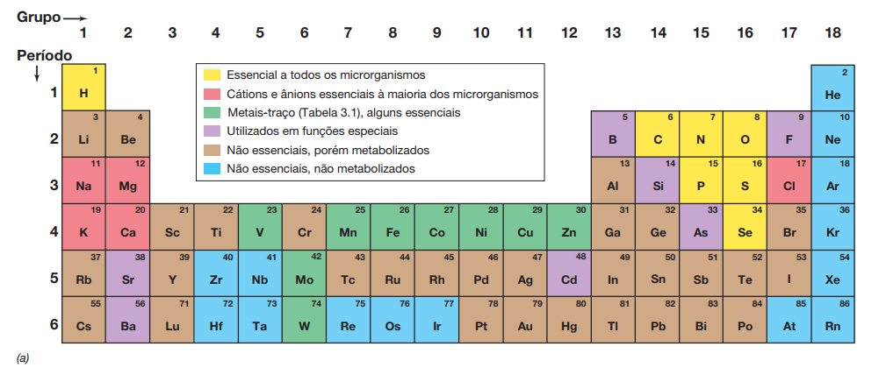

# **MICROBIOLOGIA DE BROCK** CAPÍTULO 3 - METABOLISMO MICROBIANO

## QUÍMICA E NUTRIÇÃO CELULAR

- macronutrientes: necessitam em grande quantidade
- micronutrientes: necessitam em pequena quantidade
- todos se originam nos elementos da tabela periódica
    - são essenciais: N, O, H, C, P, S, Se
- o peso seco de uma célula tem 70-80%  de água
- principais macromoléculas:
    - proteínas - 55%
        - muito diversa
    - DNA - muito pouco
    - RNA - mais abundante

<fig>Tabela de nutrientes</fig>

### Carbono

- retirado de compostos orgânicos
    - aminoácidos, ácidos graxos, ácidos orgânicos, açú-
cares, bases nitrogenadas
- 50% do peso seco
- autótrofos: sintetizam suas próprias estruturas a partir do CO2

### Nitrogênio

- 13% do peso seco
- amônia (NH3 - principal), nitrato (NO3–) ou em gás nitrogênio (N2 - apenas por procariodos fixadores de nitrogênio)

### OUTROS

- Fósforo
    - em acidos nucleicos
    - fonte: fosfato (PO4 2–)
- Enxofre
    - em cisteína, metionina e várias vitaminas
    - fonte: sulfato (SO4 2–)
- Potássio: necessário em enzimas
- Magnésio: ribossomos, acidos nucleicos, membranas e enzimas
- Cálcio e Sódio são essenciais principalmente para microorganismos marinhos

### Metais

- Ferro: importante na respiração celular e transporte de elétrons
- elementos-traço: cofatores em enzimas
- fatores de crescimento: micronutrientes orgânicos
    - aminoacidos, purinas, pirimidinas, vitaminas
    

