#  ANVISA  - Módulo 4: Procedimentos Laboratoriais: da Requisição do Exame à Análise Microbiológica e Laudo Final 

## CAPÍTULO 3 - Microscopia e Coloração

### SEM COLORAÇÃO

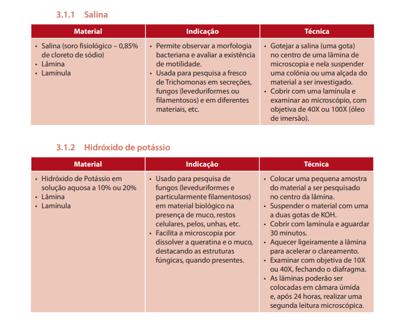

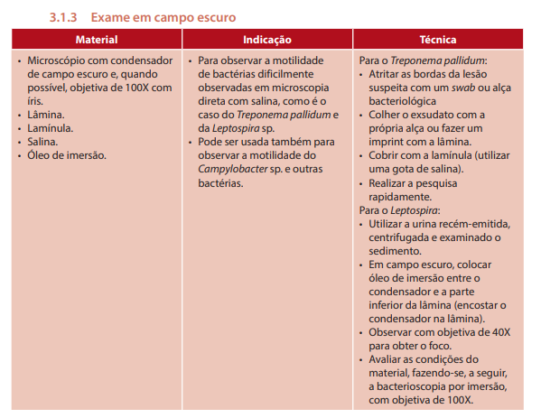

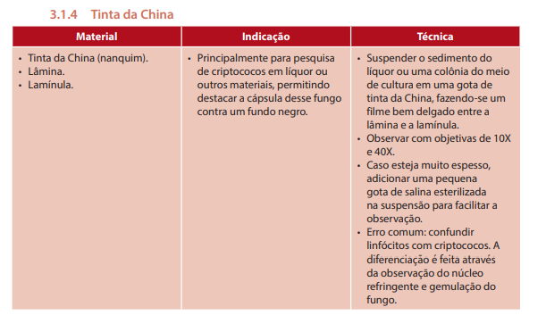

### COLORAÇÃO DE GRAM

- características:
    - cor
    - tamanho
    - forma
    - agrupamento
- recurso rápido
- amostras jovens < 24h

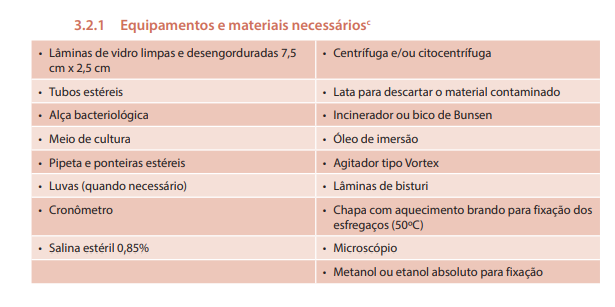

- esfregaço:
    - espessura densa
    - esparso
    - laminas limpas, novas e que estavam em alcool

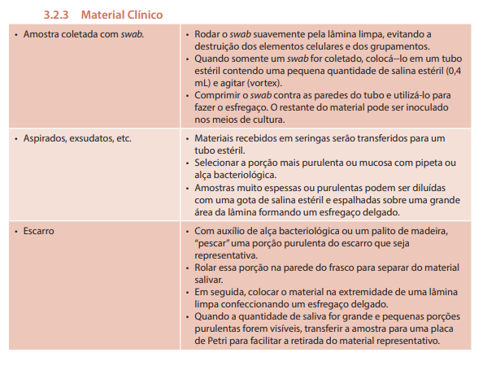
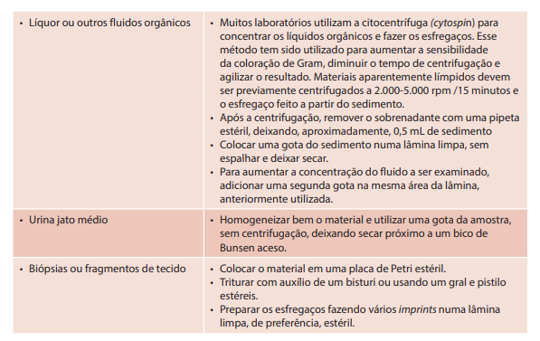

- swab: no centro da lâmina
    - fixar rapidamente em chama
- cultura em caldo: uma gota no centro da lamina
    - espalhar suavemente
- meio sólido: gota salina estéril e uma pequena porção da cultura após
    - misturar suavemente
- fixação:
    - calor: brando 50° exposto ao ar - lamina fria para colorir
    - metanol/etanol: 2 gotas após esfregaço seco - não aquecer ou lavar

- corantes:

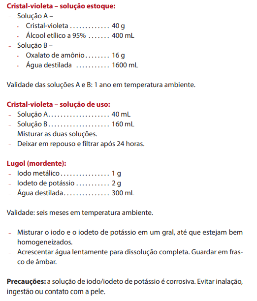
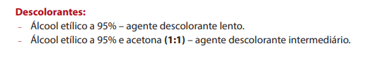
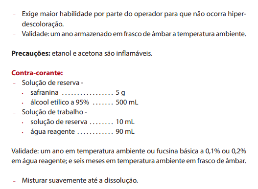

- passo a passo:

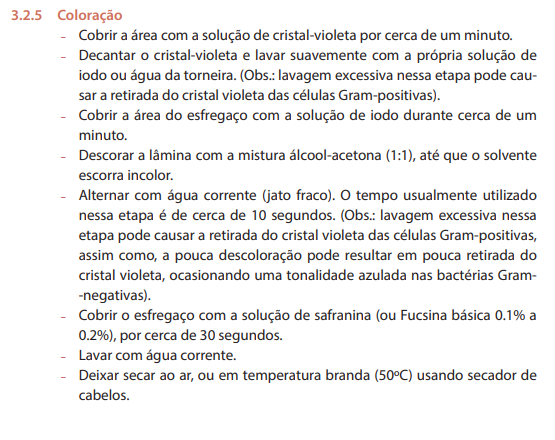

- leitura:
    - em 10x: avaliação do esfregaço como um todo
        - qualidade, uniformidade e espessura
        - presença de células normais
        - presença de bactérias tipicas da microbiota
        - presença, localização e agrupamento microbiano
        - presença de filamentos, pseudo-hifas e leveduras
    - em 100x (objetiva de imersão)

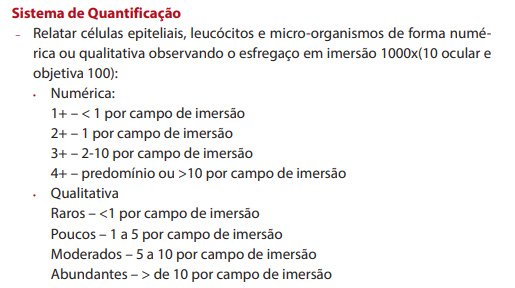
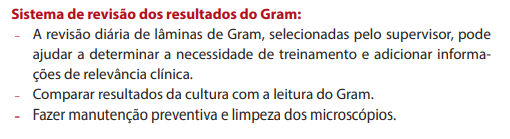

### OUTRAS COLORAÇÕES

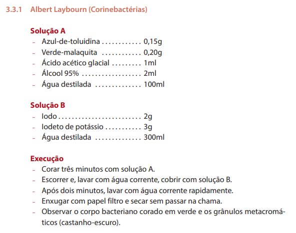

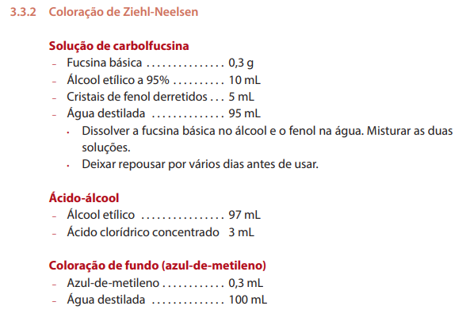

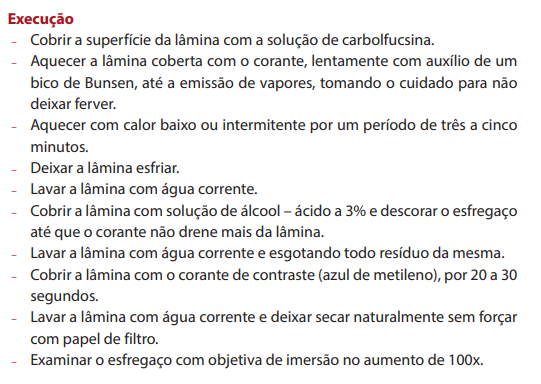

## CAPÍTULO 4 - SEMEADURA EM MEIOS DE CULTURA

ESSE CAPÍTULO TEM VÁRIOS PASSO A PASSO PARA CADA MATERIAL E CADA TIPO DE COLETA/CULTURA.

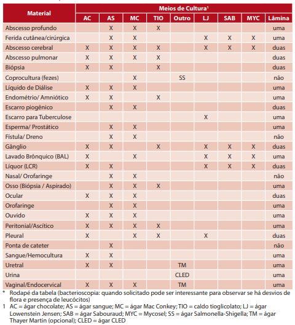

## CAPÍTULO 5 - IDENTIFICAÇÃO

Meios de cultura:
- **Agar sangue** - rico e não seletivo; gram neg e pos; fungos
- **Agar chocolate** - rico e não seletivo; bactérias aeróbias
- **Agar MacConkey** - seltivo gram neg; diferencial p/ lactose
- **Agar salmonela-shigella** - seletiva pra essas duas bacs; diferencial para lactose
- **Agar Hecktoen Enteric** - seletivo para salmonela e shigella; diferencial para lactose
- **Ágar Thayer Martin Modificado** - seletivo para adição de colistina, vancomicina e nistatina; inibe enterobac, gram pos, fungos

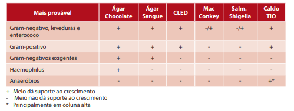
