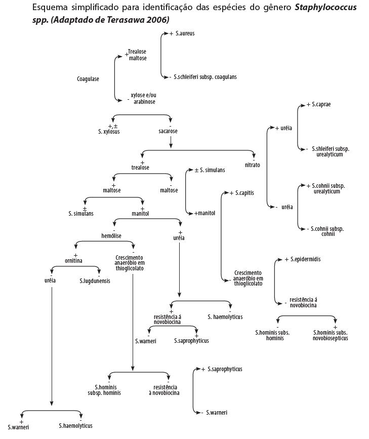
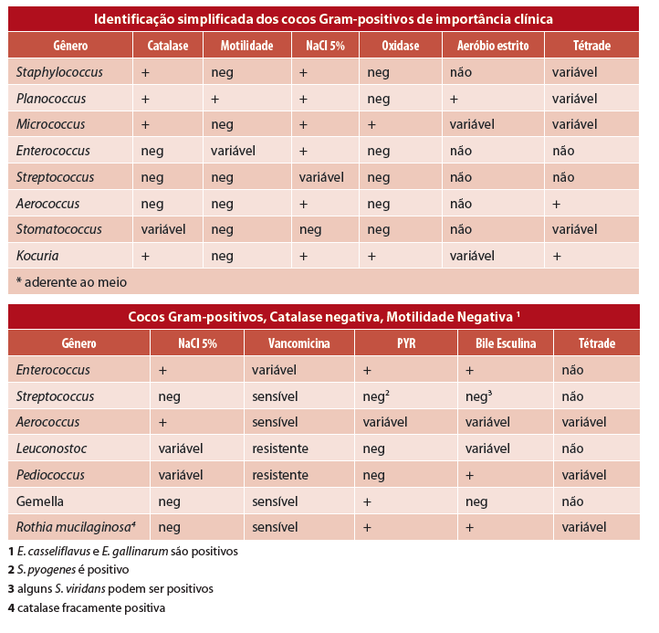
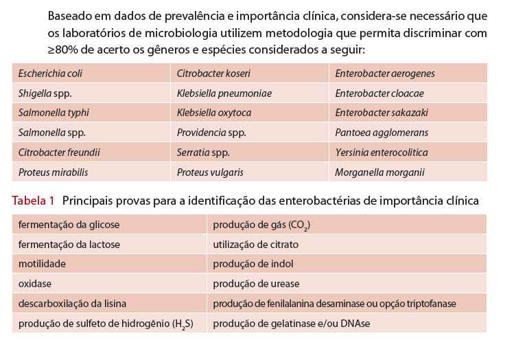
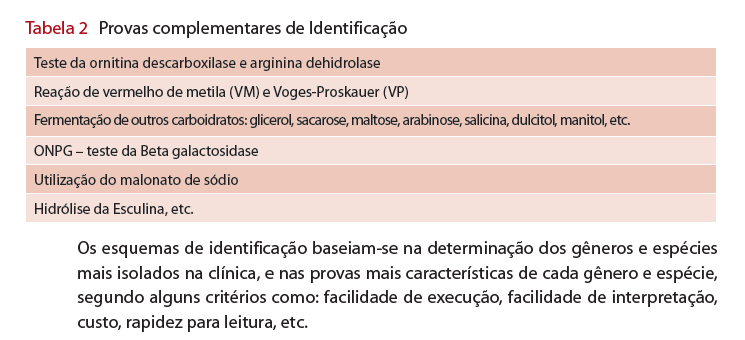
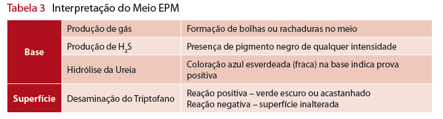
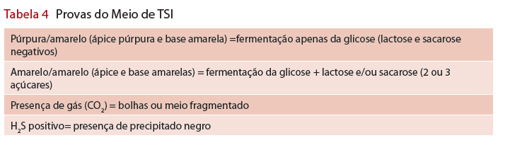
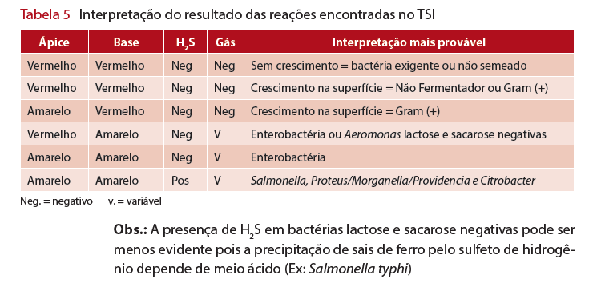
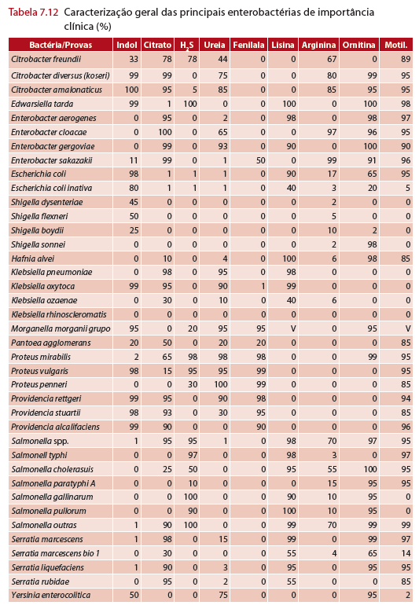
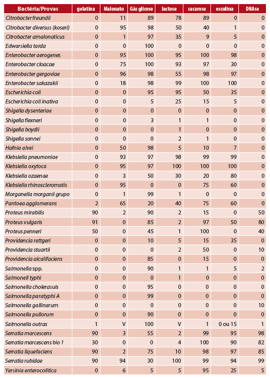

#  ANVISA  - Módulo 6: Detecção e Identificação de Bactérias de Importância Médica 

## CAPÍTULO 1 - Estafilococos, Estreptococos, Enterococos e outros

### Staphylococcus aureus

- cocos
- gram-pos
- não eporulados
- resistem no meio ambiente
- relativ resistentes ao calor
- aguentam concentração aumentada de sal
- patogeno importante e comum
  - na nasofaringe, ocasionalmente na pele e raramente na vagina
  - objetos inanimados ou outros pacientes por contato direto ou por aerossol
  - casos de resistência a Vancomicina, oxacilina
  - possui citotoxina
  - causa lesões mna pele, mucosas e pneumonia necrozante

### Estafilococos coagulase negativos - ECN

- normais em pele e mucosas
- relacionamento benigno ou simbiótico
- negativo: através de quebra na barreira cutânea
  - traumas, cortes, agulhas
  - materiais médicos - próteses, cateteres
- grande variedade de provas bioquímicas para identificação

### Estreptococos e Enterococos

- Enterococcus faecalis (90% dos casos) e Enterococcus faecium
- contaminação de pacientes e de superfícies
- resistencia a glicopeptídios como a vancomicina e teicoplanina vem sendo cada vez mais comum

### Identificação:

- inoculação primária na placa de ágar sangue de carneiro que deve ser incubada em 5% de tensão de CO2 (método da vela ou estufa de CO2)
- estafilococos são geralmente maiores, convexas, de coloração variando do branco-porcelana a amarelo podendo apresentar hemólise ou não.
- estreptococos tendem a ser menores (puntiformes), e com halos de hemólise total ou parcial (beta e alfa hemólise).
- prova da catalase
  - diferenciação definitiva
  - coleta um pouco de colonia > esfrega em lâmina limpa > uma gota de água oxigenada a 3%
  - Staphylococcaceae (estafilococos) faz bolhas
  - Streptococcaceae (estreptococos) não faz bolhas

## CAPÍTULO 3 - Enterobactérias

- um grande grupo de bacilos Gram-negativos
  - 44 gêneros
  - 176 espécies
  - quatro grupos entéricos ainda não nomeados
- encontradas em solo, agua, frutas, vegetais, carne, ovos
- não esporulados
- motilidade variável
- presença ou ausencia de O2
- meio seletivo: agar macconkey
- maioria catalase positiva, exceto a Shigella dysenteriae
- maioria oxidase negativa, exceto Plesiomonas e Aeromonas sp.
- maioria reduz o nitrato a nitrito
- 80% ou mais de todos os Gram-negativos de importância clínica
  - doenças diarreicas, infecções em feridas e queimaduras, infecção no trato urinário e respiratório, septicemia e meningite
  - enteropatogênicas:
    - Salmonella, Shigella spp., categorias diarreiogênicas de E. coli e Yersinia enterocolitica

### TIPOS DE TESTES
- convencionais: devem ser submetidos a um rigoroso controle de qualidade
- kits comerciais: previamente validados com cepas padrão e desempenho documentado
- metodos automatizados: numero ampliado de testes e maior segurança
- métodos rápidos: substratos cromogênicos para detecção de enzimas produzidas pelas bactérias

### MEIOS BIOQUÍMICOS
- Meio de Rugai - modificado por Pessoa e Silva (Meio de IAL - Instituto Adolfo Lutz)
  - 9 reações, 1 tubo
    - Na fase superior do tubo: fermentação da glicose, produção de gás, fermentação da sacarose, produção de urease, H2S e triptofano desaminase
    - camada de cera de carnaúba para separar
    - Na fase inferior: a descarboxilação da lisina e motilidade
    - tampão: produção de indol
    - bacs:
      - E. coli, Shigella (indol positiva)
      - Shigella (indol negativa)
      - Enterobacter aerogenes, Klebsiella pneumoniae, Klebsiella spp. (sacarose negativa)
      - Enterobacter cloacae, Providencia spp. (ureia positiva)
      - Morganella morganii, Providencia spp. (ureia negativa)
      - Proteus mirabilis, Proteus vulgaris, Salmonella spp., Salmonella typhi, Citrobacter freundii, Serratia marcescens (necessita provas complementares)
      - Vibrio cholerae, Vibrio spp. (oxidase positiva)
      - alguns bacilos não fermentadores
- EPM/MILI/CITRATO: 2 tubos
  - EPM: Fermentação da glicose, produção de gás, H2S, ureia, fenilalanina

  - MILI:
    - Motilidade – bactérias móveis crescem além da picada turvando o meio, enquanto as imóveis crescem apenas na linha de picada.
    - descarboxilação da lisina – lisina positivo o meio torna-se roxo, na prova negativa o meio permanece amarelado nos 2/3 inferiores
    - Após a leitura da lisina adicionar 3 gotas de reativo de Kovacs para o teste de indol – a formação de um anel rosa na superfície do meio indica positividade para o indol.
  - Citrato: prova positiva é evidenciada pelo aparecimento de coloração azul na superfície
- TSI - Meio Tríplice Açúcar Ferro
  - sistema clássico, fácil interpretação
  - necessita de provas adicionais
  - O meio é inclinado em bico de flauta, de cor vermelho cereja

### IDENTIFICAÇÃO E DESCRIÇÃO

- Secreções: Ágar sangue e Mac Conkey
- Líquidos nobres e biópsias: Ágar chocolate e Mac Conkey
- Fezes: Mac Conkey e SS
- Urina: CLED ou Ágar sangue e Mac Conkey

- Motilidade/H2S/Indol
  - Crescimento apenas na linha de picada = motilidade negativa
  - Crescimento difuso em todo o meio = motilidade positiva
  - H2S – Produção de gás sulfídrico, verificado no TSI ou SIM
    - H2S positivo = meio enegrecido
    - H2S negativo = cor inalterada do meio
  - Indol:
    - presença de cor púrpura = indol positivo
    - cor do reagente = indol negativo
- Ureia de Christensen
  - Urease positivo = cor vermelha (Proteus apresenta reação mais intensa)
  - Urease negativo = mantém cor amarelada do meio
- Citrato de Simmons
  - Citrato positivo = azul e/ou crescimento no meio
  - Citrato negativo = cor verde (inalterado)
- Fenilalanina
  - FA positivo = cor verde escuro na superfície
  - FA negativo = mantém a cor do meio inalterada

> P. 44 A 50 POSSUEM TABELAS COM OS DADOS DE DIFERENCIAÇÃO PRA CADA ENTEROBACTERIA

### IDENTIFICAÇÃO SOROLÓGICA

