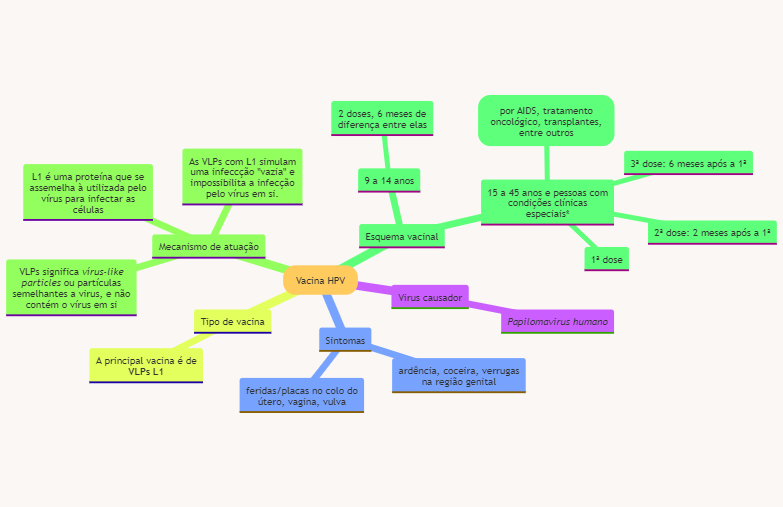
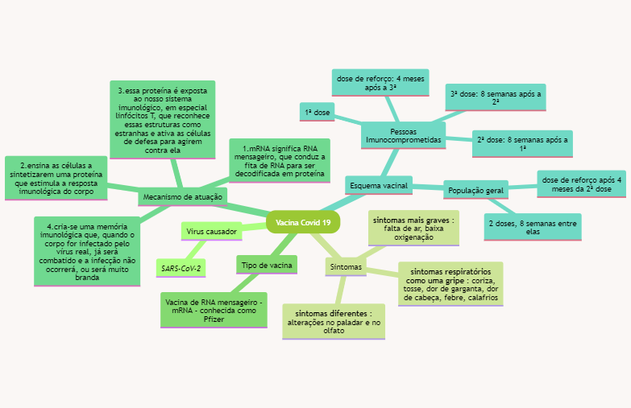

#  **AVALIAÇÕES** 

## FÓRUM - ATÉ 22/11

* [X] FEITO
* [X] POSTADO

A coloração de Gram é uma técnica muito importante para a classificação inicial de bactérias, permitindo observar o tamanho, a forma e o arranjo (se a bactéria tiver). A coloração depende de propriedades específicas da parede celular:  Bactérias Gram-positivas apresentarão coloração violeta (roxa), enquanto bactérias Gram-negativas apresentarão coloração pink ou vermelha (a depender do segundo corante utilizado).  

**Explique como funciona a coloração de Gram, enfatizando quais são as propriedades nas paredes celulares em bactérias Gram-positivas e Gram-negativas que resultam nas colorações violeta (roxa) e pink ou vermelha, respectivamente, nestas bactérias.**

A coloração de gram se inicia com o uso do corante violeta. Ele penetra a parede celular e as células ficam roxinhas. Após esse processo, é utilizado o lugol como fixador do corante na célula. O terceiro passo é o uso de álcool, que serve como um descorante, pois ele interage e dissolve os lipídeos das camadas externas das células, retirando o corante anteriormente aplicado. Por fim é aplicado um corante rosado, normalmente fucsina, para colorir as células que foram descoradas.

A etapa de uso do alcool é essencial pois nesse momento o álcool age na membrana externa das bactérias gram-negativas, que é formada em especial por lipossacarídeos (gorduras). Assim, acaba retirando o corante violeta+lugol que foram colocados ali.

Essa membrana externa não é a mesma coisa que parede celular. A parede celular é formada por peptideoglicano e ocupa cerca de 75% da parte externa de gram-positivas e apenas 5% de gram-negativas. Quando o alcool entra em contato com essa parede ele forma uma película e não consegue dissolvê-la. Como ela é muito delgada em grma-negativas, o alcool reage com a membrana externa primeiro e não forma essa película, retirando o corante.

**Após coletar amostra (de água, alimento, fezes, urina, sangue, medicamento ou outras) para análise microbiológica e classificar as bactérias da amostra como Gram-positivas ou Gram-negativas, explique como este conhecimento será útil na sua atuação como Biomédico, Farmacêutico ou Nutricionista.**

Como biomédica esse conhecimento é essencial na investigação de patógenos que estão adoecendo uma pessoa e podem até mesmo leva-la à morte. Com esse conhecimento é possível diferenciar patógenos dando uma melhor perspectiva de possíveis tratamentos para os sintomas que a pessoa apresenta.

----------
Critérios de avaliação:

Cada estudante deverá fazer, NO MÍNIMO, 2 (duas) intervenções/participações.

Intervenção 1: responder as questões motivadoras do fórum (0,7). _Resposta postada em 12/11/2023 às 10:56_

Intervenção 2: comentar a resposta de um colega de turma de maneira crítica e reflexiva (0,3).

*Resposta à postagem da colega Denise Bezerra Gomes (24 de outubro de 2023 17:23), em 16/11/2023 às 11:19*

Acho importante lembrar que o alcool utilizado no processo interage com a camada de lipídeos da membrana externa de gram-negativas, dissolvendo essa camada de proteção e retirando o corante antes depositado ali. A junção da ação do lugol nas gram+ e do alcool nas gram- facilita também entender porque a variação nas cores para cada tipo de célula bacteriana que faz com que esse modo de coloração seja tão importante e eficiente.

## QME - UN 2 - ATÉ 29/11

* [ ] FEITO

## ATV ABERTA - ATÉ 22/11

* [X] FEITO
* [X] ENVIADO

“Uma vacina é uma suspensão de organismos, ou frações de organismos, usada para induzir imunidade. Muitas doenças podem ser controladas com saneamento para impedir a disseminação e doenças sexualmente transmissíveis podem ser evitadas com o uso de preservativos. Se a prevenção falhar, as doenças bacterianas, geralmente, podem ser tratadas com antibióticos. As doenças virais, entretanto, muitas vezes não podem ser tratadas efetivamente. Portanto, a vacinação é, na maioria das vezes, o único modo possível de controle das doenças virais. Controlar uma doença não significa, necessariamente, exigir que todas as pessoas sejam imunes a ela. Se a maioria da população estiver imunizada, fenômeno chamado de imunidade coletiva (ou imunidade de rebanho), os surtos serão limitados a casos esporádicos, pois não haverá́ indivíduos suscetíveis em quantidade suficiente para sustentar a disseminação de uma epidemia.” Tortora, Gerard, J. et al. Microbiologia. Disponível em: Minha Biblioteca, (12th edição). Grupo A, 2017. 

Existem atualmente diversos tipos de vacinas:  

-Vacinas de vírus (ou bactéria) atenuado; 

-Vacinas com vírus (ou bactéria) mortos inativados; 

-Vacinas de subunidades; 

-Vacinas conjugadas; 

-Vacinas de ácidos nucleicos (DNA ou RNA). 

**Elabore um mapa mental para as doenças virais HPV e COVID19 contendo:**

a. O vírus causador da doença; 

b. Os principais sintomas; 

c. O tipo de vacina (para COVID19, utilizar a vacina de RNA mensageiro – mRNA); 

d. O mecanismo de atuação da vacina; 

e. O esquema vacinal proposto pelo Ministério da Saúde.  

#### Vacina do HPV
    Virus causador
        _Papilomavirus humano_
    Sintomas
        ardência, coceira, verrugas na região genital
        feridas/placas no colo do útero, vagina, vulva
    Tipo de vacina
        A principal vacina é de __VLPs L1__
    Mecanismo de atuação
        VLPs significa _vírus-like particles_ ou partículas semelhantes a virus, e não contém o vírus em si
        L1 é uma proteína que se assemelha à utilizada pelo vírus para infectar as células
        As VLPs com L1 simulam uma infeccção "vazia" e impossibilita a infecção pelo vírus em si.
    Esquema vacinal
        9 a 14 anos
            2 doses, 6 meses de diferença entre elas
        15 a 45 anos e pessoas com condições clínicas especiais*
            *Imunossuprimidos (por AIDS, tratamento oncológico, transplantes, entre outros)
            1ª dose
            2ª dose: 2 meses após a 1ª
            3ª dose: 6 meses após a 1ª

#### Vacina Covid 19

    Virus causador
        _SARS-CoV-2_
    Sintomas
        **sintomas respiratórios como uma gripe**: coriza, tosse, dor de garganta, dor de cabeça, febre, calafrios
        **sintomas mais graves**: falta de ar, baixa oxigenação
        __sintomas diferentes__: alterações no paladar e no olfato
    Tipo de vacina
        Vacina de RNA mensageiro - mRNA - conhecida como Pfizer
    Mecanismo de atuação
        1.mRNA significa RNA mensageiro, que conduz a fita de RNA para ser decodificada em proteína
        2.ensina as células a sintetizarem uma proteína que estimula a resposta imunológica do corpo
        3.essa proteína é exposta ao nosso sistema imunológico, em especial linfócitos T, que reconhece essas estruturas como estranhas e ativa as células de defesa para agirem contra ela
        4.cria-se uma memória imunológica que, quando o corpo for infectado pelo vírus real, já será combatido e a infecção não ocorrerá, ou será muito branda
    Esquema vacinal
        População geral
            2 doses, 8 semanas entre elas
            dose de reforço após 4 meses da 2ª dose
        Pessoas Imunocomprometidas
            1ª dose
            2ª dose: 8 semanas após a 1ª
            3ª dose: 8 semanas após a 2ª
            dose de reforço: 4 meses após a 3ª

**Critério avaliativo:**

1) Mapa mental HPV: 0,75 pontos. [ ] Pronto    

2) Mapa mental COVID19 (vacina de mRNA): 0,75 pontos [ ] pronto  

Você pode elaborar um único mapa, contemplando as duas doenças, ou fazer um mapa para cada doença, no entanto, deve ser enviado um único arquivo. Somente um envio será permitido.   

Atenção - Poderão ser feitos desenhos ou utilização de imagens da internet, no entanto, a elaboração do mapa deverá ser realizada com suas palavras. Somente as imagens poderão ser obtidas da internet. Mapas mentais obtidos e/ou copiados da internet ou do colega terão nota zero atribuída ao estudante. Em caso de uso de imagens da internet, citar a fonte. 

## QME - UN 4 - ATÉ 29/11

* [ ] FEITO
