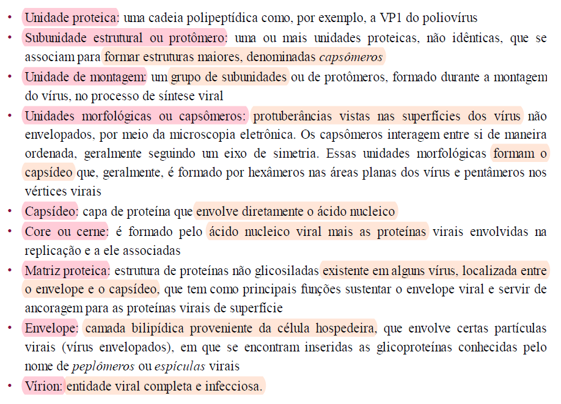
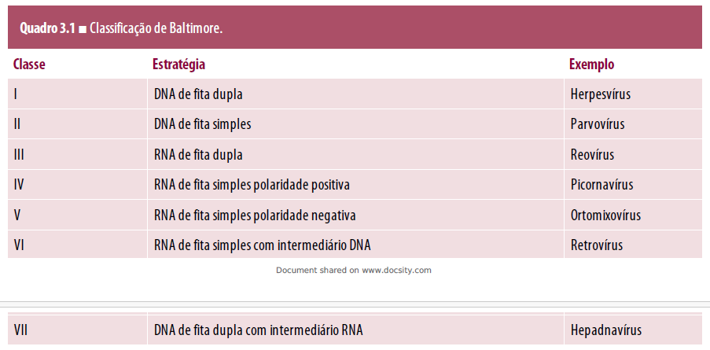

# **VIROLOGIA HUMANA** CAPÍTULO 3 - PROPRIEDADES GERAIS DOS VÍRUS

## DEFINIÇÃO DE VIRUS

- estruturas subcelulares, um arranjo molecular
    - muito menores que bactérias
    - não vistos em micro optico
    - passam por filtros esterilizantes
    - DNA ou RNA
- não são cultivados em meio artificial
- sem metabolismo fora da celula
    - replicação intracelular exclusiva
    - requer metabolismo celular ativo
- **vírion**: partícula viral completa
    - uma molecula de ácido nucleico
    - capa de proteína em volta
    - pode ter lipidios e açucares
    - carrega o genoma viral para uma célula
- **vírus gigantes - NCLDV**
    - possíveis de ver no micro optico
    - codificam muitas proteínas
    - virophages: vírus-satélites
        - suportam replicação viral

## CONCEITOS IMPORTANTES

## ESTRUTURAS VIRAIS E SUAS CARACTERÍSTICAS
### Capsídeo

- arquitetura:
    - forma e composição das subunidades proteicas
        - artifício da natureza para economia de energia
        - ligações não covalentes entre elas: mantém rigidez,facilita a liberação do material
    - interações com o ácido nucleico
    - regras de Caspar e Klug (1962)
        - formas geométricas específicas: helicoidal, icosaédrica ou complexa (pseudossimetria)
        - icosaedro/icoságono:
            - 20 triângulos equiláteros
                - cada um com 3 protômeros
            - 12 vértices
        - helicoidal
            - aparece no micro como um tubo/cilindro
            - > O nucleocapsídeo helicoidal pode ser rígido, como observado em vírus de plantas, ou longo e flexível, como nos vírus de animais.
        - complexa
            - varia, pode misturar as duas
            - pode ter mais estruturas, como espículas e fibras

### Envelope

- brotamento das membranas celulares (do hospedeiro)
    1. ESPÍCULAS VIRADAS PARA MEMBRANA CELULAR
    2. interação com proteinas viaris citoplasmaticas

### ÁCIDO NUCLEICO VIRAL 

- maioria haploide
    - retrovirus é diploide
- fita dupla, simples, circular ou linear
- fita unica ou segmentada
- DNA:
    - fita dupla (herpesvírus) ou de fita simples (parvovírus)
- RNA:
    - fita simples:
        - polaridade positiva (tipo RNAm), imediatamente traduzido
        - polaridade negativa, complementar a um RNAm - a maioria é um unico segmento
    - fita dupla: normalmente segmentado
    - intermediário de DNA em seu processo de replicação
- < genoma, < proteínas codificadas
    - proteínas estruturais
        - compõem a estrutura da partícula
    - proteínas não estruturais
        - codificadas pelo genoma e traduzidas somente durante a replicação
- nucleocapsídeo: conjunto capsideo+ácido nucleico

## BIOSSÍNTESE VIRAL

> Alguns vírus podem infectar vários
tipos celulares, enquanto outros são bastante restritos quanto ao tipo celular que infectam.

- permissividade à replicação viral: quando uma célula consegue replicar o genoma viral e montar particulas infecciosas a partir dessa replicação
- replicar genoma viral é diferente de gerar infecção
- para a replicação ocorrer é necessário ambiente propício - DNA no nucleo, RNA no citoplasma
    - necessário lidar, também, com as diversas enzimas OU FALTA DELAS
    - RNAm viral consegue inibir o RNAm celular
    - classificação de Baltimore - de acordo com a estratégia de replicação
    - 

### ETAPAS
1. **ADSORÇÃO**

- ligação específica de uma ou mais proteínas virais com proteínas na superfície celular
- RECEPTORES: estruturas das células formadas por proteínas que são reconhecidas pelas espículas. Geram o primeiro contato do vírus com a célula
- susceptibilidade: o fato de existir receptores que possibilitem tal conexão (_não é permissividade_)
- a ligação é irreversivel
    - com exceção
dos ortomixovírus e de alguns paramixovírus, que podem ser eluídos da superfície da célula por
meio da ação de uma enzima viral (neuraminidase).

2. **PENETRAÇÃO**

- = internalização
- depende de energia
- há mudanças conformacionais nas proteínas virais
    - posisbilita a entrada do material na célula
- mecanismos:
    - virus envelopados:
        - expõe aminoácidos hidrofóbicos das glicoproteínas virais
        - fusão entre o envelope viral e a membrana plasmática celular (fusão direta)
        - liberação do genoma viral para o citoplasma celular
    - virus envelopados ou não:
        - endocitados pela célula
        - quando envelopados: acidificação da vesícula e fusão
        - quando não-envelopados: outros mecanismos de lise da vesícula, podendo ou não depender do ph
    - formação de poro na membrana plasmático
    - penetração direta: entrada do virus todo

3. **MORFOGÊNESE**

- automontagem - no núcleo ou no citoplasma
- a maturação - criação dos vírions, a maioria dentro da celula, alguns depois de sair dela
- liberação do vírus das células infectadas por lise ou brotamento

## CLASSIFICAÇÃO INTERNACIONAL DOS VIRUS

- 
